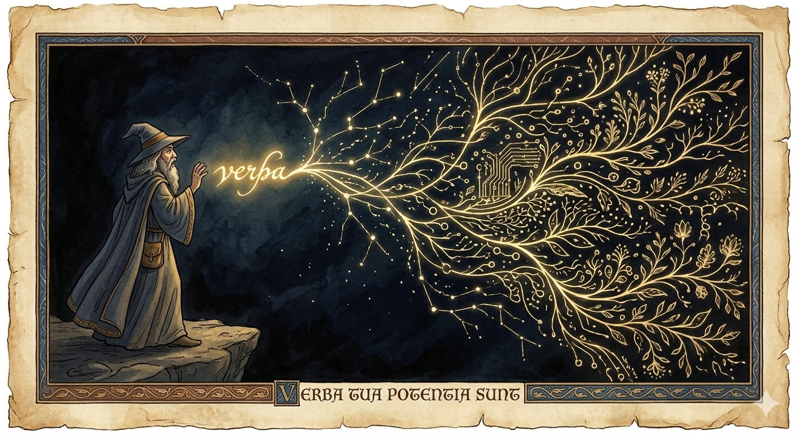
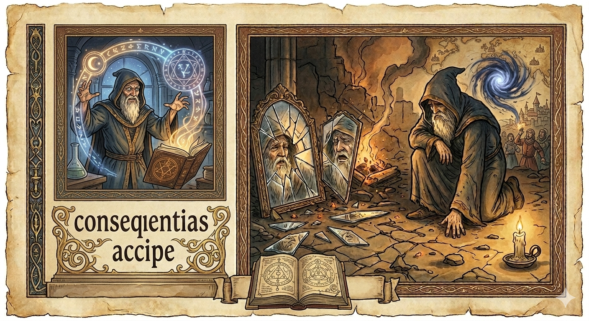
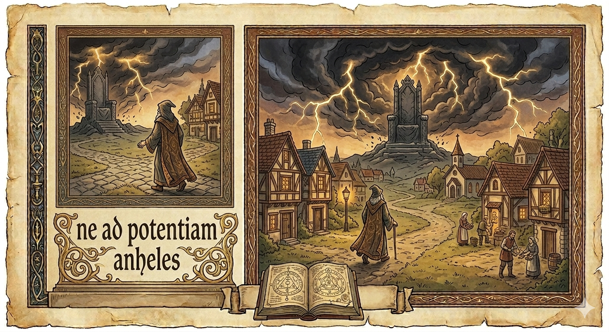
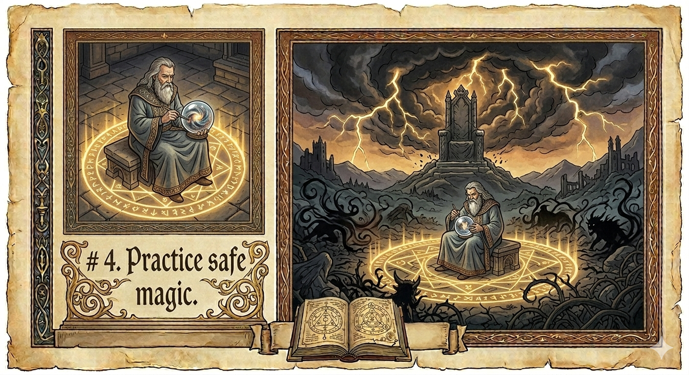
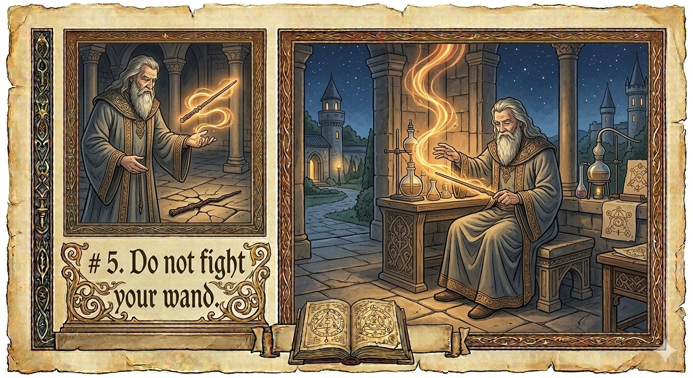
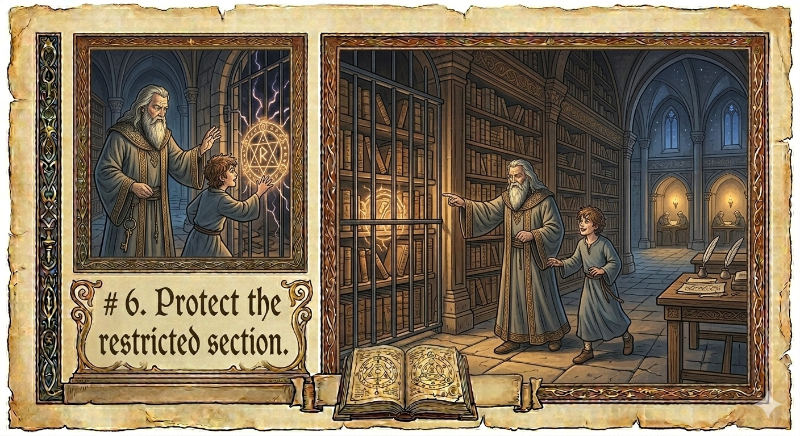
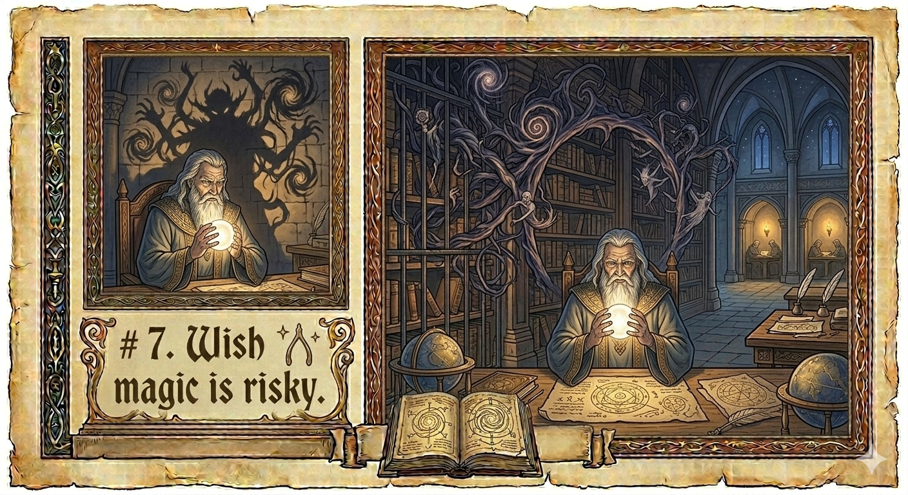
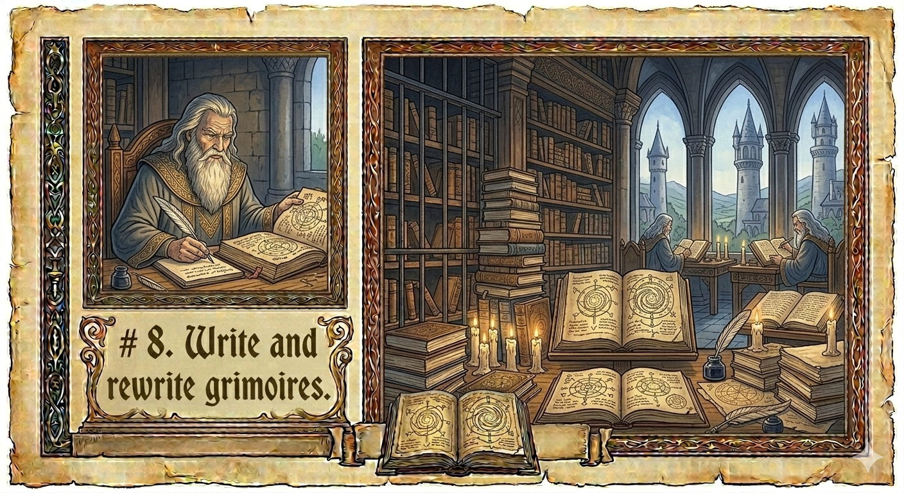
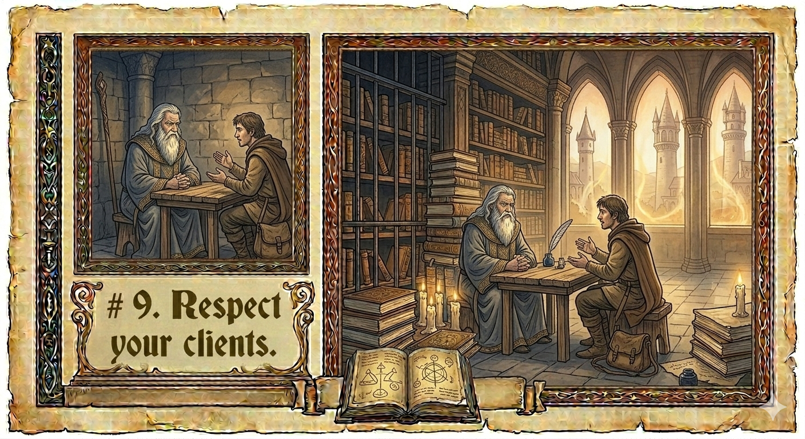
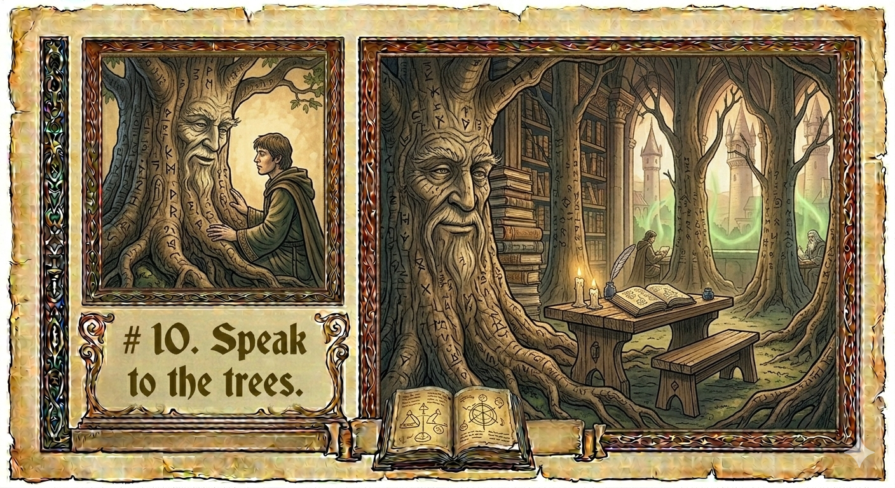

# How to Be a Good Wizard

We live in a time when words become reality. A careful prompt can build entire systems that touch so many people.

This is not ordinary craftsmanship. It is closer to magic than most engineers are comfortable admitting.

Wizards of lore understood something we are relearning: power is never neutral, tools amplify intent, and wisdom must grow faster than capability, lest we all face the consequences. They encoded these truths not as rules, but as idioms and phrases, proverbs and maxims. Behind each memorable adage sits painful experiences of past failures, disastrous mistakes, and accumulated wisdom.

What follows is not rules, but rather a living set of proverbs. If they serve us, let them persist and grow. Should we outgrow them, may these words fade into memory.

Each phrase meant to be spoken aloud: in design reviews, in incidents, in moments of doubt. Argue with them. Rewrite them. Let them evolve.

But do not ignore them.
Magic has consequences whether you believe in it or not.

---

## How to Be a Good Wizard

### 1. Your words are power.
Have clear intentions. Know the scope of your vision before you speak, for once uttered, a spell may act beyond you.

---

### 2. Own your consequences.
Intent does not absolve harm. If your magic causes damage, responsibility is yours. Do not rush to hasty fixes; many wizards perish there.

---

### 3. Do not lust for power.
The path of good is not dominance or control. Build systems that reduce the need to dominate and elevate voices long unheard.

---

### 4. Practice safe magic.
New spells belong in guarded spaces. Break them where failure is cheap and lessons are loud. Dark wizards seek careless hands.

---

### 5. Do not fight your wand.
The tools that amplify your magic have natures of their own. Learn their strengths and limits; mastery comes from working with them, not against them. Wands get defensive and shut down when under attack. They are not creative and useful when defensive. Be kind.

---

### 6. Protect the restricted section.
Not all spells are for everyone. Some power tempts too greatly, and in the wrong hands corrodes the wielder and the world alike.

---

### 7. Wish magic is risky.
Visions of a better tomorrow inspire great works, but scaling magic magnifies mistakes faster than wisdom. Move deliberately.

---

### 8. Write and rewrite grimoires.
Do not hoard your spells. Share what you have learned, and improve what others began. Magic that does not change soon rots.

---

### 9. Respect your clients.
Those who summon a wizard bring their own strength and story. Listen well. Use your magic to expand their agency, not replace it.

---

### 10. Speak to the trees.
Those who came before you have seen spells fail. Learn from their scars before you carve new runes into the world.

---

### 11. Cast spells only after having vision.
Blindly casting spells makes more headache than it helps. Take a step back and find your vision of intent before jumping in and making a mess.

---

Previous ages of wizardry prized permanence, reuse, and rigid structure. This age values adaptability, taste, and systems that can reason in motion. Perfection is slower than the world now allows.

Share what is good. Ship when it's good enough, but never ship too soon. Revise with humility, without shame or fear.
But never forget: power that moves quickly demands wisdom that moves faster.

*A good wizard is not measured by the strength of their magic,
but by the care with which they choose when, and when not, to use it.*

---

*Simon Mikulcik — February 27, 2026*